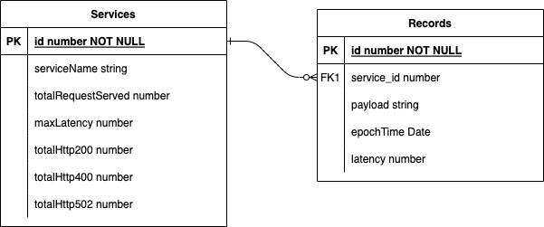
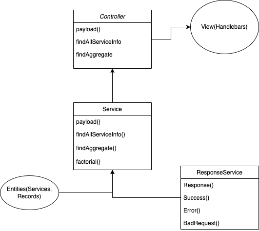

# Craft Demo

- [Craft Demo](#craft-demo)
  - [Description](#description)
  - [Installation](#installation)
  - [Running the app](#running-the-app)
  - [Test](#test)
  - [Endpoints](#endpoints)
  - [AWS test database](#aws-test-database)
  - [Dockerize](#dockerize)
  - [Backend design](#backend-design)
    - [Database entity design:](#database-entity-design)
    - [Backend MVC workflow:](#backend-mvc-workflow)
  - [License](#license)

## Description

It's the repository for intuit A4A craft demo interview. Using [nestjs](https://docs.nestjs.com/) as backend framework. Requirements see [here](./SRE%20A4A%20Craft%20Demo%20(1).docx).

## Installation

```bash
$ npm install
```

## Running the app

```bash
# development
$ npm run start

# watch mode
$ npm run start:dev

# production mode
$ npm run start:prod
```

visit localhost:3000 to see the webpage.

## Test

```bash
# unit tests
$ npm run test
```

More detailed black box tests see postman.

## Endpoints

|Type|Endpoint|Description|
|----|--------|-----------|
|Get |/v1/service_id/info|Get a services's aggregated information|
|Post|/v1/service_id/data|Add payload to service|
|Get |/v1/aggregate?time=5|Return a html table of aggregated information of records in specific time|

## AWS test database

host: crafttestdb.ctriu0r3rcfj.us-east-1.rds.amazonaws.com
port: 5432
user: postgres
password: 123456
database: test

## Dockerize

Docker Hub: yiweizhu/craft-demo:1.0

## Backend design

### Database entity design:

Two tables: records_v1, services_v1



### Backend MVC workflow:


## License

Nest is [MIT licensed](LICENSE).
